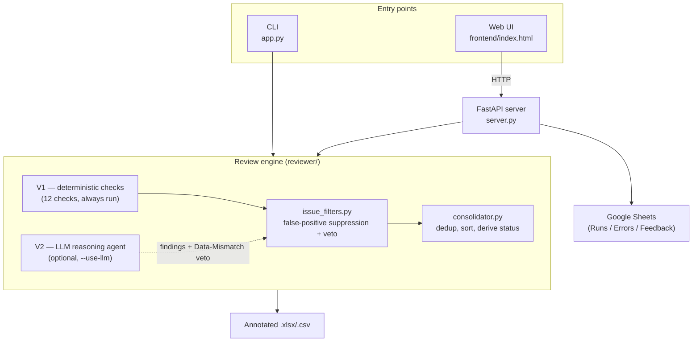
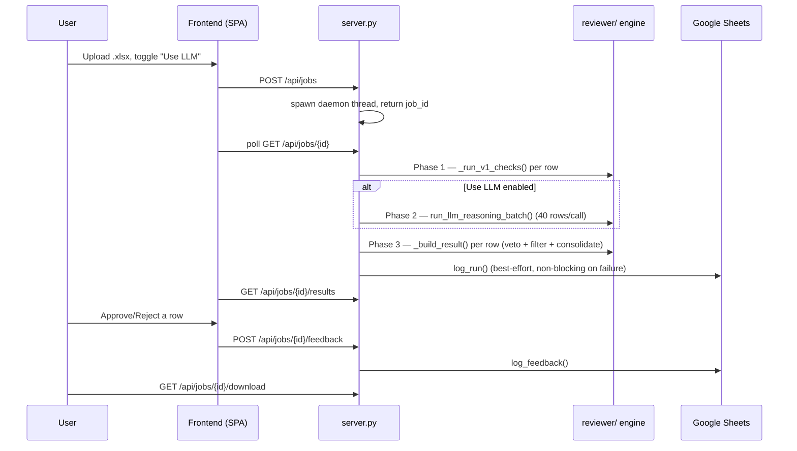
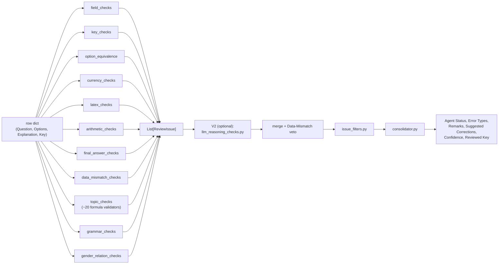
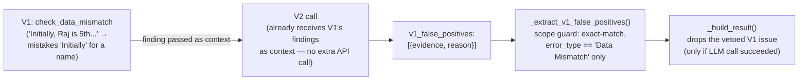

# Architecture

A short, diagram-first orientation to how the Aptitude Content Reviewer is put together. For exhaustive per-module detail (every check, every API route, every env var), see [PROJECT_DOCUMENTATION.md](PROJECT_DOCUMENTATION.md) — this doc is the map, that doc is the terrain.

---

## 1. System at a glance

Two tiers, one pipeline:

| Tier | What | Cost | Always runs? |
|---|---|---|---|
| **V1** | Pure Python — regex, arithmetic (AST-eval), value-equivalence matching | Free, instant | Yes |
| **V2** | One LLM call per row (or per batch) via OpenRouter | API tokens | Only with `--use-llm` / "Use LLM" toggle |

V1 alone is a complete, self-sufficient reviewer. V2 is a bolt-on that (a) catches reasoning-level issues V1 structurally can't (ambiguity, invalid assumptions, wrong-operation formulas) and (b) doubles as a second opinion on one specific fragile V1 check (§4).

---

## 2. Request lifecycle (web path)

The CLI path (`app.py`) runs the identical `_run_v1_checks` / `_build_result` functions directly, row-by-row or in `--batch-size`-sized LLM batches — no server, no threads, no job store. Same engine, two front doors. `evals/run_evals.py` is a **third** front door onto the same functions, used to score the engine against hand-labeled ground truth instead of reviewing real submissions.

---

## 3. Inside the review engine

Every check function has the same shape: `check_x(row) -> List[ReviewIssue]`. This uniform contract is what makes the pipeline in `_run_v1_checks()` ([app.py](app.py)) just a flat list of function calls — no shared mutable state, no ordering dependencies between V1 checks themselves (ordering only matters for the *filters* and *consolidator* stages downstream, which see the combined list).

`ReviewIssue` ([models.py](reviewer/models.py)) is the one data contract every layer speaks: `severity, error_type, field, evidence, reason, suggested_fix, confidence`.

---

## 4. The V1 ↔ V2 relationship (why it's not just "two independent passes")

V1 and V2 aren't fully independent — there's a deliberate feedback loop, and it exists to solve a specific, recurring failure mode: **a cheap regex heuristic is by nature an open-set-matching problem approximated by a closed-set blocklist**, and closed sets are always incomplete.

Concretely: V1's name-detection regex (`data_mismatch_checks.py`) can mistake a capitalized sentence-adverb ("Initially", "Consequently") for a person's name. Rather than trying to enumerate every possible non-name word (a losing battle), the existing V2 prompt also asks the model to review V1's own `Data Mismatch` findings and flag any that are semantically obviously not a real name swap. The veto is narrowly scoped — exact evidence-text match, restricted to one `error_type` — so V2 can only clean up this one known-fragile check, never silently override anything else. If the LLM call fails, the veto simply doesn't happen; V1's finding stands. See [PROJECT_DOCUMENTATION.md §8.8](PROJECT_DOCUMENTATION.md#88-v1-false-positive-veto-data-mismatch-only) for the full mechanics.

This is the same principle behind the `verify_calculation` tool (§8.3 in the docs): don't trust a fallible fast-path in isolation when a slower, smarter pass is already being paid for anyway — make the smarter pass double-check the fast path's specific weak spots instead of re-deriving everything from scratch.

---

## 5. Design principles worth knowing before you touch this code

1. **Every check is independently testable and independently wrong.** A check function takes a row dict and returns a list of issues — no side effects, no shared state. This makes it trivial to construct a synthetic row and verify a fix (or a regression) in isolation, which is how every bug fix in this codebase gets verified: build the failing row, confirm the bug, fix it, confirm both the false-positive case *and* a genuine-error case now behave correctly.
2. **False positives are more expensive than false negatives here.** A wrongly-rejected valid question wastes a human reviewer's time re-checking something that was already fine; a missed real error gets caught on the same human read-through anyway. This is why so much of the check logic is about *not* flagging (nearest-antecedent guards, common-word blocklists, cross-type equivalence, standard-convention carve-outs) rather than about flagging more aggressively.
3. **Heuristics get sharpened, not wrapped in exception handling.** When a check misfires, the fix targets the actual pattern gap (e.g. "sentence adverbs end in -ly, names don't" — a general rule, not a specific-word patch) over adding a special case for the one example that was reported. A check with no valid trigger condition at all (like the old ambiguous-wording check) gets deleted outright rather than patched into uselessness.
4. **V1 is free and V2 is a considered opt-in, never a silent fallback.** V1 must remain fully self-sufficient; V2's role is additive (new issue categories) and corrective (the Data-Mismatch veto), never load-bearing for basic correctness. If the LLM call fails, the system fails *loud* — an otherwise-clean row's status is explicitly downgraded to `System Error / Needs Retry` (§8.7 in the docs) rather than silently reporting "Approved."
5. **No database, by design, not by oversight.** Job state is in-process memory; Google Sheets is the only durable record, and it's optional and best-effort (every Sheets call is wrapped so a logging failure never breaks a review). This keeps the deployment trivially simple (one web service, no managed DB) at the cost of losing in-flight job state on restart — an accepted tradeoff for the current scale.

---

## 6. Where to add things

| You want to... | Touch this |
|---|---|
| Add a new deterministic check | New `check_x(row) -> List[ReviewIssue]` function in an existing or new `reviewer/*.py` module, registered in `_run_v1_checks()` ([app.py](app.py)) |
| Change what V2 looks for | `SYSTEM_PROMPT` / `RUBRIC_GUIDANCE` in [llm_prompts.py](reviewer/llm_prompts.py) |
| Suppress a known false-positive pattern across checks | `filter_known_false_positives()` in [issue_filters.py](reviewer/issue_filters.py) — only for well-understood, recurring patterns, not a catch-all |
| Change how Agent Status / severity rolls up | [consolidator.py](reviewer/consolidator.py) |
| Add a new API route or change job lifecycle | [server.py](server.py) |
| Change what gets logged externally | [sheets_logger.py](reviewer/sheets_logger.py) |
